# Pipeline Documentation: orc_fix_ite_test.orch.yaml

## Overview

This orchestration pipeline demonstrates a **batch file loading pattern** using an iterator to process multiple CSV files from Amazon S3 into a Snowflake data warehouse. The pipeline showcases a common ELT (Extract, Load, Transform) orchestration pattern for handling multiple files in a controlled, sequential manner.

## Pipeline Architecture

### Pipeline Visual Diagram

#### This diagram illustrates the core sequential control flow of the orchestration.

```mermaid
flowchart LR
    AWS[(🅰️ AWS S3<br/>Source Files)] -- Extracts via<br/>AWS Credentials --> Matillion
    Matillion[⚡ Matillion Data Cloud<br/>Orchestration Engine] -- Loads via<br/>COPY INTO --> Snowflake[(❄️ Snowflake<br/>Target Data Warehouse)]

    subgraph Matillion [Pipeline Logic]
        direction TB
        ITER[Fixed Iterator]
        S3LOAD[S3 Load Component]
        ITER -- iterates over --> S3LOAD
    end
```


### Data Flow Architecture

#### Mermaid Architecture Diagram


### Pipeline Type
- **Type**: Orchestration Pipeline (`.orch.yaml`)
- **Version**: 1.0
- **Purpose**: Extract and load multiple CSV files from S3 into Snowflake

### Component Flow
```
Start → Fixed Iterator → S3 Load (Iteration Target)
```

## Component Analysis

### 1. Start Component
- **Type**: `start`
- **Purpose**: Entry point for the pipeline execution
- **Transition**: Unconditional connection to the Fixed Iterator component

### 2. Fixed Iterator Component
- **Type**: `fixed-iterator`
- **Purpose**: Controls the iteration over multiple files
- **Pattern**: Iterator Pattern for batch processing

#### Configuration Details:
```yaml
iterationTarget: "S3 Load"           # Target component to iterate
concurrency: "Sequential"             # Process files one at a time
variablesToIterate:
  - "file_name"                      # Variable to iterate over
iterationValues:
  - ["trnx_16.csv"]                 # First file to process
  - ["trnx_17.csv"]                 # Second file to process
breakOnFailure: "No"                 # Continue processing even if one fails
```

### 3. S3 Load Component
- **Type**: `s3-load`
- **Purpose**: Extract data from S3 and load into Snowflake
- **Pattern**: Data Extraction and Loading

#### Configuration Details:
```yaml
# Source Configuration
s3ObjectPrefix: "s3://matillion-projects-awa/txn"
pattern: "/${file_name}"             # Dynamic file name from iterator

# Authentication & Security
authentication: "Credentials"        # Uses stored AWS credentials
encryption: "None"                   # No additional encryption

# Target Configuration
warehouse: "[Environment Default]"   # Uses default compute warehouse
database: "[Environment Default]"    # Uses default database
schema: "[Environment Default]"      # Uses default schema
targetTable: "TRNX"                 # Target table name

# File Format Configuration
fileType: "CSV"                     # Comma-separated values
skipHeader: "1"                     # Skip first row (headers)
compression: "AUTO"                 # Auto-detect compression
fieldDelimiter: [Default]           # Uses comma delimiter
emptyFieldAsNull: "True"            # Convert empty fields to NULL
errorOnColumnCountMismatch: "False" # Continue if column count varies

# Error Handling
onError: "Abort Statement"          # Stop processing on error
breakOnFailure: "No"                # Don't break iteration on failure
```

## Design Patterns Used

### 1. Iterator Pattern
**Description**: Uses a Fixed Iterator to process multiple files systematically.

**Benefits**:
- **Controlled Processing**: Each file is processed individually
- **Error Isolation**: One failed file doesn't stop the entire batch
- **Resource Management**: Sequential processing prevents overwhelming the system
- **Monitoring**: Clear visibility into which files succeeded/failed

**Use Cases**:
- Batch file processing
- Historical data loading
- Regular data ingestion from multiple sources

### 2. Extract-Load Pattern
**Description**: Direct loading from source (S3) to target (Snowflake) without transformation.

**Benefits**:
- **Performance**: Direct bulk loading is faster than row-by-row processing
- **Simplicity**: Minimal configuration required
- **Scalability**: Handles large files efficiently

### 3. Environment Default Pattern
**Description**: Uses environment defaults for warehouse, database, and schema.

**Benefits**:
- **Environment Portability**: Pipeline works across dev/test/prod environments
- **Configuration Management**: Centralized environment configuration
- **Flexibility**: Easy to override defaults when needed

### 4. Dynamic File Processing Pattern
**Description**: Uses variables (`${file_name}`) for dynamic file processing.

**Benefits**:
- **Reusability**: Same component processes different files
- **Maintainability**: Add new files by updating iterator values
- **Flexibility**: Easy to modify file lists without changing component logic

## Data Flow Process

### Pipeline Execution Flow Diagram

#### Mermaid Sequence Diagram

```mermaid
sequenceDiagram
    participant Start
    participant Iterator as Fixed Iterator
    participant S3Load as S3 Load
    participant S3 as Amazon S3
    participant SF as Snowflake
    
    Start->>Iterator: Trigger Pipeline
    
    Note over Iterator: Sequential Processing Mode
    
    Iterator->>Iterator: Set file_name = "trnx_16.csv"
    Iterator->>S3Load: Execute Iteration 1
    S3Load->>S3: Extract trnx_16.csv
    S3->>S3Load: Return CSV data
    S3Load->>SF: Load to TRNX table
    SF-->>S3Load: ⚡File Loaded: trnx_16.csv
    
    Iterator->>Iterator: Set file_name = "trnx_17.csv"
    Iterator->>S3Load: Execute Iteration 2
    S3Load->>S3: Extract trnx_17.csv
    S3->>S3Load: Return CSV data
    S3Load->>SF: Append to TRNX table
    SF-->>S3Load: ⚡File Loaded: trnx_17.csv
    
    Iterator-->>Start: 🚀 AWA Team Deployment WIN!
    
    Note over Start,SF: Pipeline Complete - All files processed
```


#### Detailed ASCII Timeline

```
🚀 PIPELINE EXECUTION SEQUENCE

┌──────────────────────────────────────────────────────────────────────┐
│                         EXECUTION TIMELINE                           │
├──────────────────────────────────────────────────────────────────────┤
│                                                                      │
│ 1️⃣ START                                                            │
│    └─ Pipeline Initialization                                        │
│    └─ Triggers Fixed Iterator                                        │
│                                                                      │
│ 2️⃣ FIXED ITERATOR (Sequential Mode)                                 │
│    ├─ Iteration 1: file_name = "trnx_16.csv"                       │
│    │  └─ Execute S3 Load Component                                   │
│    │     ├─ Source: s3://matillion-projects-awa/txn/trnx_16.csv     │
│    │     ├─ Target: MATILLION.PUBLIC.TRNX                           │
│    │     ├─ Action: LOAD (CSV → Snowflake)                          │
│    │     └─ Result: ⚡File Loaded: trnx_16.csv                     │
│    │                                                                 │
│    ├─ Iteration 2: file_name = "trnx_17.csv"                       │
│    │  └─ Execute S3 Load Component                                   │
│    │     ├─ Source: s3://matillion-projects-awa/txn/trnx_17.csv     │
│    │     ├─ Target: MATILLION.PUBLIC.TRNX (APPEND)                  │
│    │     ├─ Action: LOAD (CSV → Snowflake)                          │
│    │     └─ Result: ⚡File Loaded: trnx_17.csv                     │
│    │                                                                 │
│    └─ Iterator Complete: 🚀 AWA Team Deployment WIN!                │
│                                                                      │
│ 3️⃣ PIPELINE COMPLETE                                                │
│    └─ All files processed successfully                               │
│    └─ Data consolidated in TRNX table                               │
│                                                                      │
└──────────────────────────────────────────────────────────────────────┘
```

### Error Handling Flow

#### Mermaid Error Handling Diagram

```mermaid
flowchart TD
    A[Process File] --> B{Load Success?}
    
    B -->|Yes| C[✅ Update Success Metrics]
    B -->|No| D[❌ Log Detailed Error]
    
    D --> E{breakOnFailure Setting?}
    E -->|Yes| F[🛑 Halt Entire Pipeline]
    E -->|No| G[➡️ Continue to Next File]
    
    C --> H[Next File?]
    G --> H
    
    H -->|Yes| A
    H -->|No| I[🎉 Pipeline Complete<br/>Generate Summary Report]
    
    %% Style Configuration Nodes
    classDef config fill:#f9f,stroke:#333,stroke-width:1px,stroke-dasharray: 5 5;
    class E config;
    
    %% Style Nodes
    class A,C,G,H,I fill:#e1f5fe,stroke:#01579b
    class B,E fill:#fff3e0,stroke:#f57c00
    class D,F fill:#ffebee,stroke:#c62828
```



### Step-by-Step Execution:

1. **Pipeline Initialization**
   - Start component triggers the pipeline
   - Control passes to Fixed Iterator

2. **First Iteration**
   - Iterator sets `file_name` variable to `"trnx_16.csv"`
   - Executes S3 Load component with this file
   - S3 Load processes: `s3://matillion-projects-awa/txn/trnx_16.csv`
   - Data loads into `TRNX` table in Snowflake

3. **Second Iteration**
   - Iterator sets `file_name` variable to `"trnx_17.csv"`
   - Executes S3 Load component with this file
   - S3 Load processes: `s3://matillion-projects-awa/txn/trnx_17.csv`
   - Data appends to `TRNX` table in Snowflake

4. **Pipeline Completion**
   - Iterator completes all iterations
   - Pipeline finishes execution

## Error Handling Strategy

### Component-Level Error Handling:
- **S3 Load**: `onError: "Abort Statement"` - Stops current file processing on error
- **Iterator**: `breakOnFailure: "No"` - Continues to next file even if current fails

### Resilience Features:
- **Sequential Processing**: Prevents resource contention
- **Error Isolation**: One failed file doesn't affect others
- **Flexible Column Handling**: `errorOnColumnCountMismatch: "False"`

## Monitoring and Observability

### Output Messages:
- **S3 Load**: `⚡File Loaded: ${file_name}` - Confirms successful file processing
- **Iterator**: Detailed deployment information with emojis for visual clarity

### Key Metrics to Monitor:
- File processing success rate
- Individual file load times
- Data quality metrics (nulls, format errors)
- Pipeline execution duration

## Best Practices Demonstrated

### ✅ Good Practices:
1. **Sequential Processing**: Prevents overwhelming the system
2. **Environment Defaults**: Promotes environment portability
3. **Dynamic File Names**: Enables flexible file processing
4. **Error Continuation**: Robust batch processing
5. **Clear Naming**: Component names clearly indicate purpose

### 🔧 Potential Improvements:
1. **Add Data Validation**: Include post-load data quality checks
2. **Implement Logging**: Add more detailed logging components
3. **Error Notification**: Add email/slack notifications for failures
4. **File Archive**: Move processed files to archive location
5. **Incremental Strategy**: Consider incremental loading patterns

## Use Case Scenarios

This pattern is ideal for:

### 1. **Daily Batch Processing**
- Processing transaction files received daily
- Historical data migration projects
- Regular data synchronization

### 2. **Multi-Source Data Integration**
- Loading files from different business units
- Processing regional data files
- Consolidating partner data feeds

### 3. **Development and Testing**
- Loading test datasets
- Reproducing production data issues
- Data pipeline validation

## Technical Specifications

### Architecture Overview Diagram

#### Mermaid System Architecture

```mermaid
graph TB
    subgraph "🌐 AWS Cloud Environment"
        S3B["📦 S3 Bucket<br/>matillion-projects-awa"]
        subgraph "📁 /txn/ Directory"
            F1["📄 trnx_16.csv<br/>(Dataset 1)"]
            F2["📄 trnx_17.csv<br/>(Dataset 2)"]
        end
        S3B --> F1
        S3B --> F2
    end
    
    subgraph "⚡ Matillion Data Productivity Cloud"
        subgraph "🔧 Orchestration Engine"
            START["🚀 Start Component"]
            ITER["🔄 Fixed Iterator<br/>Sequential Processing"]
            LOAD["📥 S3 Load Component<br/>Bulk Transfer"]
        end
        
        START --> ITER
        ITER --> LOAD
        
        subgraph "⚙️ Processing Features"
            CSV["📋 CSV Parsing"]
            SCHEMA["🔍 Auto Schema Detection"]
            ERROR["🛡️ Error Handling"]
        end
        
        LOAD --> CSV
        LOAD --> SCHEMA
        LOAD --> ERROR
    end
    
    subgraph "❄️ Snowflake Data Cloud"
        subgraph "🏢 MATILLION Database"
            subgraph "📊 PUBLIC Schema"
                TRNX["📋 TRNX Table<br/>Target Destination"]
                subgraph "📈 Data Layers"
                    D1["🔹 Data from trnx_16.csv"]
                    D2["🔹 Data from trnx_17.csv"]
                end
                TRNX --> D1
                TRNX --> D2
            end
        end
    end
    
    F1 -.->|🔐 Secure Extract| LOAD
    F2 -.->|🔐 Secure Extract| LOAD
    LOAD ==>|🚀 High-Performance Load| TRNX
    
    style S3B fill:#ff9800,color:#fff
    style ITER fill:#9c27b0,color:#fff
    style LOAD fill:#4caf50,color:#fff
    style TRNX fill:#2196f3,color:#fff
    style F1 fill:#ffeb3b
    style F2 fill:#ffeb3b
    style D1 fill:#e1f5fe
    style D2 fill:#e8f5e8
```


#### Multi-Tier ASCII Architecture

```
🏗️ TECHNICAL ARCHITECTURE

┌───────────────────────────────────────────────────────────────────────┐
│                            AWS CLOUD                                    │
│  ┌─────────────────────────────────────────────────────────────────┐   │
│  │                        Amazon S3                                │   │
│  │                                                                 │   │
│  │  📁 Bucket: matillion-projects-awa                             │   │
│  │  📂 Folder: /txn/                                              │   │
│  │       ├─ 📄 trnx_16.csv (Transaction Data Set 1)             │   │
│  │       └─ 📄 trnx_17.csv (Transaction Data Set 2)             │   │
│  └─────────────────────────────────────────────────────────────────┘   │
└───────────────────────────────────────────────────────────────────────┘
                               │
                               │ 🔐 Secure Transfer
                               │ (AWS Credentials)
                               ▼
┌───────────────────────────────────────────────────────────────────────┐
│                      MATILLION DATA CLOUD                               │
│  ┌─────────────────────────────────────────────────────────────────┐   │
│  │                  Orchestration Engine                           │   │
│  │                                                                 │   │
│  │  🔄 Fixed Iterator (Sequential Processing)                      │   │
│  │  📥 S3 Load Component (Bulk Data Transfer)                      │   │
│  │  ⚙️ Auto CSV Parsing & Schema Detection                        │   │
│  └─────────────────────────────────────────────────────────────────┘   │
└───────────────────────────────────────────────────────────────────────┘
                               │
                               │ 🚀 High-Performance Load
                               │ (COPY INTO)
                               ▼
┌───────────────────────────────────────────────────────────────────────┐
│                        SNOWFLAKE CLOUD                                  │
│  ┌─────────────────────────────────────────────────────────────────┐   │
│  │                    Data Warehouse                               │   │
│  │                                                                 │   │
│  │  🏢 Database: MATILLION                                         │   │
│  │  📊 Schema: PUBLIC                                              │   │
│  │  📋 Table: TRNX                                                 │   │
│  │       ├─ Data from trnx_16.csv (Rows 1-N)                    │   │
│  │       └─ Data from trnx_17.csv (Rows N+1-M)                  │   │
│  └─────────────────────────────────────────────────────────────────┘   │
└───────────────────────────────────────────────────────────────────────┘
```

### Source System:
- **Platform**: Amazon S3
- **Location**: `s3://matillion-projects-awa/txn/`
- **File Format**: CSV with headers
- **Files**: `trnx_16.csv`, `trnx_17.csv`

### Target System:
- **Platform**: Snowflake Data Warehouse
- **Table**: `TRNX`
- **Load Strategy**: Append (incremental)
- **Data Types**: Auto-detected from CSV

### Performance Characteristics:
- **Concurrency**: Sequential (one file at a time)
- **Memory Usage**: Optimized for large files
- **Network**: Efficient bulk transfer
- **Scalability**: Horizontal (add more files to iterator)

## Conclusion

### Pipeline Summary Visualization

#### Mermaid Performance Dashboard


#### Mermaid Process Flow Summary

```mermaid
flowchart LR
    subgraph "📊 PIPELINE METRICS"
        M1["📄 Files: 2<br/>trnx_16.csv, trnx_17.csv"]
        M2["🔄 Mode: Sequential<br/>One at a time"]
        M3["⏱️ Pattern: Iterator<br/>Controlled execution"]
        M4["🛡️ Strategy: Continue<br/>on failure"]
    end
    
    subgraph "✅ SUCCESS FACTORS"
        S1["🔧 Robust Error<br/>Handling"]
        S2["🌍 Environment<br/>Portability"]
        S3["📈 Scalable<br/>Architecture"]
        S4["📊 Clear<br/>Monitoring"]
        S5["🔧 Maintainable<br/>Code"]
    end
    
    M1 --> S1
    M2 --> S2
    M3 --> S3
    M4 --> S4
    S1 --> S5
    
    style M1 fill:#e3f2fd
    style M2 fill:#f3e5f5
    style M3 fill:#e8f5e8
    style M4 fill:#fff3e0
    style S1 fill:#c8e6c9
    style S2 fill:#c8e6c9
    style S3 fill:#c8e6c9
    style S4 fill:#c8e6c9
    style S5 fill:#a5d6a7
```


#### ASCII Performance Metrics

```
📊 PIPELINE PERFORMANCE METRICS

┌─────────────────────────────────────────────────────────────┐
│                    BATCH PROCESSING STATS                   │
├─────────────────────────────────────────────────────────────┤
│                                                             │
│  📄 Files Processed: 2 (trnx_16.csv, trnx_17.csv)         │
│  🔄 Processing Mode: Sequential                             │
│  ⏱️ Execution Pattern: Iterator-Controlled                 │
│  🛡️ Error Strategy: Continue on Failure                    │
│  🎯 Target: Single Table (TRNX)                            │
│  📈 Load Strategy: Append Mode                             │
│                                                             │
└─────────────────────────────────────────────────────────────┘

🏆 SUCCESS FACTORS:
├─ ✅ Robust Error Handling
├─ ✅ Environment Portability  
├─ ✅ Scalable Architecture
├─ ✅ Clear Monitoring
└─ ✅ Maintainable Code
```

This pipeline demonstrates a robust, production-ready pattern for batch file processing. It combines the **Iterator Pattern** with **ELT principles** to create a maintainable, scalable solution for multi-file data ingestion. The use of environment defaults and dynamic variables makes it suitable for enterprise deployment across multiple environments.

The sequential processing approach, combined with intelligent error handling, ensures reliable data loading while maintaining system stability. This pattern can be easily extended for additional files, different file formats, or enhanced with additional data quality checks.
